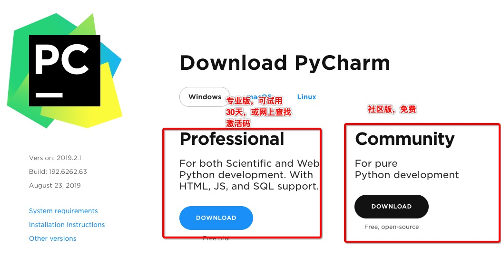

## python
1. 官网 [https://www.python.org/](https://www.python.org/)
3. 源码压缩包 [https://www.python.org/downloads/source/](https://www.python.org/downloads/source/)
2. 参考手册 [https://docs.python.org/3/](https://docs.python.org/3/)
	1. Standard Library - [https://docs.python.org/3.7/library/index.html#library-index](https://docs.python.org/3.7/library/index.html#library-index)
	2. The Python Tutorial [https://docs.python.org/3.7/tutorial/index.html](https://docs.python.org/3.7/tutorial/index.html)


## 一、 python 环境搭建
1. 在mac上安装python（mac自带2.7）
	1. 方法一： 使用 `homebrew` 安装， `brew install python3`。
	1. 方法二： 官网下载安装程序，双击安装。

2. 在windows上安装python
	1. 官网下载安装程序，双击安装。（勾选 `Add Python 3.x to PATH` 将 `python` 添加至环境变量）

3. 在linux上安装python
	1. 下载源码压缩包后解压编译安装。
```
tar -zxvf Python-3.x.y.tgz
cd Python-3.x.y
./configure
make && make install
```

4. 检验是否成功安装
	1. 终端执行 `python --version`

5. python2和3可以共存与一台主机，使用时需要指明。（pip同样）
6. IDE安装 - PyCharm
	1. 下载地址: [https://www.jetbrains.com/pycharm/download/](https://www.jetbrains.com/pycharm/download/)

## 二、 python解释器
1. `.py` 文本文件是由 `python` 解释器来执行的。
2. 官网下载的 `python` 其解释器是 `CPython`，是由C语言开发的。（`python` 语言规范和解释器都是开源的，还有以下几种常见的解释器：`IPython`、 `PyPy`、 `Jython`、 `IronPython`等）

## 三、 python基础语法 - 基本概念
1. 文件编码
	1. python3默认源文件以 `UTF-8` 编码。
2. 标识符
	1. 首位字母或下划线，其他位置字母、数字和下划线。
3. 保留字
```
['False', 'None', 'True', 'and', 'as', 'assert', 'break', 'class', 'continue', 'def', 'del', 'elif', 'else', 'except', 'finally', 'for', 'from', 'global', 'if', 'import', 'in', 'is', 'lambda', 'nonlocal', 'not', 'or', 'pass', 'raise', 'return', 'try', 'while', 'with', 'yield']
```
4. 注释
	1.  一般注释 `#`
```
# 注释
# 注释
```
	2. 多行注释
```
'''
这是多行注释，用三个单引号
这是多行注释，用三个单引号 
这是多行注释，用三个单引号
'''
```
5. 代码块
	1. 使用缩进表示
6. 运算符
	1. 算数运算符 加减乘除取模取整（`//`）幂（`**`）
	2. 比较运算符 等于不等大于小于不小于不大于
	3. 赋值运算符 加等减等乘等除等取模等取整等幂等
	4. 位运算符 按位与或非异或、左移右移
	5. 逻辑运算符 布尔与或非（`and`、`or`、`not`）
	6. 成员运算符 `in`、 `not in`
	7. 身份运算符 `is`、 `in not`（判断是否引用自统一对象）
	8. => 运算符优先级
6. 条件判断 `if – elif – else`， 没有 `switch - case`
7. 循环语句 `for - in` 和 `while`， 没有 `do - while`
	1. `while - else` 
	2. `break` 跳出循环
	3. `continue` 跳过剩余语句进入下一轮循环

## 四、 python基础语法 - 基本数据类型和变量
1. 数字（Number）
	1. python3 支持 `int`（整数）、`float`（浮点数）、`bool`（布尔）、 `complex`（复数）。
		1. 没有python2 中的long。
		2. 表示布尔类型的 `True` 和 `Fales` 他们的值是1和0，可以和数字相加减。
```
a, b, c, d = 20, 5.5, True, 4+3j
print(type(a), type(b), type(c), type(d))
# <class 'int'> <class 'float'> <class 'bool'> <class 'complex'>
```
	2. 数字类型转换（整数计算是精确的，浮点数计算会四舍五入，与机器有关）
```
int(x)
float(x)
complex(x, y)
```
	3. 文档 
		1. Numeric Types — int, float, complex - [https://docs.python.org/3.7/library/stdtypes.html#numeric-types-int-float-complex](https://docs.python.org/3.7/library/stdtypes.html#numeric-types-int-float-complex)
		2. Numeric and Mathematical Modules - [https://docs.python.org/3.7/library/numeric.html](https://docs.python.org/3.7/library/numeric.html)
2. 字符串（String）
	1. `\` 转义，`r` 原始字符串
		1. => 需要转义的字符
	2. `+` 连接字符串， `*` 复制字符串， `%` 格式化字符串
		1. => 格式化符号
	4. 索引
		1. 左往右 `0` 开始，右往左 `-1` 开始
	4. 字符串不能改变
```
s = 'abc'
s[0] = 'd'
#  'str' object does not support item assignment
```
	5. 多行字符串
```
HTML = '''
<HTML>
  <HEAD>
	<TITLE> title </TITLE>
  </HEAD>
  <BODY>
	<div> content </div>
  </BODY>
</HTML>
'''
```
	3. 字符串和**编码**
		1. 为什么要编码？ -> 计算机只能处理数字，处理文本需先转换为数字。
		2. 常见编码
			1. ASCII 1字节
			2. Unicode 2字节
			3. UTF-8 1-6字节可变长：英文1字节，中文3字节，生僻字符4-6字节 => 包含ASCII
		3. 常见编码工作方式：
			1. 计算机内存中使用Unicode编码，当要保存到硬盘或者网络传输时转换为UTF-8。
			2. 操作文本文件时，UTF-8编码的文本文件转换为Unicode编码到内存中。
			3. 浏览网页时，服务器会把生成的Unicode内容转换为UTF-8再传输。
		4. python3中的字符串在内存中是以Unicode编码的，所以支持多种语言。
		5. 区分 `'ABC'` 和 `b'ABC'`：
			1. 前者是 `str`，一个字符对应若干字节，
			2. 后者是 `bytes`，每个字符只占用一个字节。
		6. 如上需要保存到硬盘或者在网络上传输时需要把 `str` 变为以字节为单位的 `bytes` -> 使用 `str` 的 `encode()` 方法可以编码为指定的 `bytes`
		2. 从硬盘或者网络读到的字节流，需要变为 `str` -> 使用 `bytes` 的 `decode()` 方法
		1. `.py` 文本文件包含中文时，需要指定编码方式为UTF-8，python解释器读取 `.py` 文件时按 UTF-8 读取才不会出现乱码，如下：
```
# -*- coding: utf-8 -*-
```
	5. 文档
		1. Text Sequence Type — str - [https://docs.python.org/3.7/library/stdtypes.html#text-sequence-type-str](https://docs.python.org/3.7/library/stdtypes.html#text-sequence-type-str)
		2. string — Common string operations - [https://docs.python.org/3.7/library/string.html](https://docs.python.org/3.7/library/string.html)
3. 列表（List）
	1. 索引
		1. 左往右 `0` 开始，右往左 `-1` 开始
	1. `+` 连接列表， `*` 复制列表
	2. 列表中的元素可以改变
```
a = [1,2,3,4,5,6]
a[2:5] = [] 
# 将对应的元素值设置为 [] 
# [1,2,6]
```
	2. 文档
		1. Sequence Types — list, tuple, range - [https://docs.python.org/3.7/library/stdtypes.html#sequence-types-list-tuple-range](https://docs.python.org/3.7/library/stdtypes.html#sequence-types-list-tuple-range)
		2. More on Lists - [https://docs.python.org/3.7/tutorial/datastructures.html#more-on-lists](https://docs.python.org/3.7/tutorial/datastructures.html#more-on-lists)
5. 元组（Tuple）
	1. 
5. 集合（Set）
	1. 
6. 字典（Dict）
	1. 
7. => 数字、字符串和元组是不可变数据
8. 变量：python中任何数据都是“对象”，变量用来指向这些对象。
```
a = 'ABC'
b = a
a = 'XYZ'
print(b)
# 'ABC'
# 对变量赋值b = a是把变量b指向真正的对象，该对象是变量a所指向的。随后对变量a的赋值不影响变量b的指向。
```


