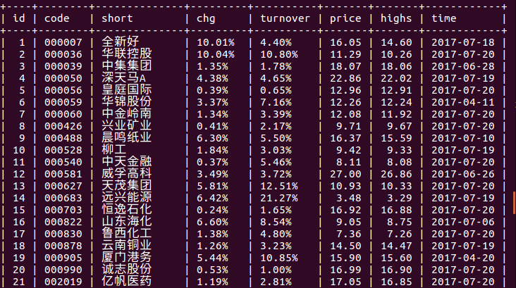
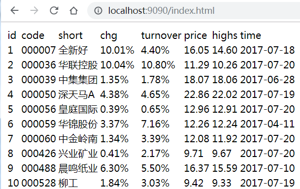

# 实现简单web框架
## 1. 多进程 http 服务器
知识点：
- `socket` tcp 
- http
- 多进程 `multiprocessing`

`server.py` 代码如下：
```
import socket
import re
import multiprocessing

def service_client(client_socket, addr):
    print("为一个客户端进行服务")
    # 接收请求
    request = client_socket.recv(1024).decode("utf-8")  # byte -> str

    if (request):
        # 获取请求头
        request_header = request.splitlines()[0]
        print("来自 %s:%s 的请求, 请求头是 %s" % (addr[0], addr[1], request_header))

        # 匹配请求内容
        # GET /index.html HTTP/1.1
        result = re.search(r"/([^ ]*)", request_header)  # 匹配请求内容
        file_name = "index.html"
        if result:
            tmp = result.group(1)
            if tmp != "":
                file_name = tmp
        print("请求的静态文件是： %s" % file_name)

        # 返回响应
        try:
            f = open("./" + file_name, "rb")
        except:
            response = "HTTP/1.1 404 NOT FOUNT\r\n"  # 响应头
            response += "\r\n"  # 空行
            response += "<html><meta charset='UTF-8'><h1>"+file_name+" Not Found</h1></html>"  # 响应体
            client_socket.send(response.encode("utf-8"))
        else:
            html = f.read()
            f.close()

            response = "HTTP/1.1 200 OK\r\n"  # 响应头
            response += "\r\n"  # 空行
            client_socket.send(response.encode("utf-8"))
            client_socket.send(html)

    # 关闭套接字
    client_socket.close()
    print("服务结束")

def main():
    # 创建套接字
    tcp_socket = socket.socket(socket.AF_INET, socket.SOCK_STREAM)
    # 设置当服务器先close，即服务器四次挥手之后资源能够立即释放，这样就保证了下次运行程序时，可以正常启动，否则会报 OSError:[Errno 98] Address already in ues
    tcp_socket.setsockopt(socket.SOL_SOCKET, socket.SO_REUSEADDR,1)
    # 绑定
    tcp_socket.bind(("", 9090))
    # 监听
    tcp_socket.listen(128)

    while True:
        # 等待新客户端连接
        new_socket, client_addr = tcp_socket.accept()

        # 为这个客户端服务
        p = multiprocessing.Process(target=service_client, args=(new_socket, client_addr))
        p.start()
        # 创建子进程时会复制创建之前主进程所有的变量，`new_socket`和 client_socket` 指向同一个fd（文件描述符），
        # 该fd此时有2个引用，子进程 `client_socket.close` 后仍需主进程`new_socket.close` ，该fd的引用为0，才能真正关闭socket。
        new_socket.close()

    # 关闭监听套接字
    tcp_socket.close()

if __name__ == "__main__":
    main()
```

## 2. 多进程 http 服务器面向对象实现 创建WSGIServer类
知识点：
- 面向对象

修改 `server.py` 代码如下：
```
import socket
import re
import multiprocessing

class WSGIServer(object):
    def __init__(self):
        # 创建套接字
        self.tcp_socket = socket.socket(socket.AF_INET, socket.SOCK_STREAM)
        # 设置当服务器先close，即服务器四次挥手之后资源能够立即释放
        self.tcp_socket.setsockopt(socket.SOL_SOCKET, socket.SO_REUSEADDR, 1)
        # 绑定
        self.tcp_socket.bind(("", 9090))
        # 监听
        self.tcp_socket.listen(128)

    def service_client(self, client_socket, addr):
        print("为一个客户端进行服务")
        # 接收请求
        request = client_socket.recv(1024).decode("utf-8")  # byte -> str

        if (request):
            # 获取请求头
            request_header = request.splitlines()[0]
            print("来自 %s:%s 的请求, 请求头是 %s" % (addr[0], addr[1], request_header))

            # 匹配请求内容
            # GET /index.html HTTP/1.1
            result = re.search(r"/([^ ]*)", request_header)  # 匹配请求内容
            file_name = "index.html"
            if result:
                tmp = result.group(1)
                if tmp != "":
                    file_name = tmp
            print("请求的静态文件是： %s" % file_name)

            # 返回响应
            try:
                f = open("./" + file_name, "rb")
            except:
                response = "HTTP/1.1 404 NOT FOUNT\r\n"  # 响应头
                response += "\r\n"  # 空行
                response += "<html><meta charset='UTF-8'><h1>" + file_name + " Not Found</h1></html>"  # 响应体
                client_socket.send(response.encode("utf-8"))
            else:
                html = f.read()
                f.close()

                response = "HTTP/1.1 200 OK\r\n"  # 响应头
                response += "\r\n"  # 空行
                client_socket.send(response.encode("utf-8"))
                client_socket.send(html)

        # 关闭套接字
        client_socket.close()
        print("服务结束")

    def run_forever(self):

        while True:
            # 等待新客户端连接
            new_socket, client_addr = self.tcp_socket.accept()

            # 为这个客户端服务
            p = multiprocessing.Process(target=self.service_client, args=(new_socket, client_addr))
            p.start()
            # 创建子进程时会复制创建之前主进程所有的变量，`new_socket`和 client_socket` 指向同一个fd（文件描述符），
            # 该fd此时有2个引用，子进程 `client_socket.close` 后仍需主进程`new_socket.close` ，该fd的引用为0，才能真正关闭socket。
            new_socket.close()

        # 关闭监听套接字
        self.tcp_socket.close()

if __name__ == "__main__":
    wsgi_server = WSGIServer()
    wsgi_server.run_forever()
```

## 3. 让Web服务器支持动态请求
需求：除支持返回静态资源（如 `xx.html` ）外，还支持执行动态请求（对应业务逻辑处理）（这里假定以 `.py` 结尾就是动态资源的请求） 

修改 `server.py` 代码如下：
```
def service_client(self, client_socket, addr):
		...
		# 返回响应
		# 假定以.py结尾就是动态资源的请求
		if file_name.endswith(".py"):
		    header = "HTTP/1.1 200 OK\r\n"
			# 业务逻辑（假定返回当前时间）
		    body = "time: %s" % time.ctime()
		else:
		    try:
		        f = open("./" + file_name, "rb")
		    except:
		        header = "HTTP/1.1 404 NOT FOUNT\r\n"
		        body = "<html><meta charset='UTF-8'><h1>" + file_name + " Not Found</h1></html>"  # 响应体
		    else:
		        header = "HTTP/1.1 200 OK\r\n"
		        body = f.read().decode("utf-8")
		        f.close()
		
		response = header + "\r\n" + body
		client_socket.send(response.encode("utf-8"))
		...
```

## 4. HTTP 服务器和 web 框架解耦
知识点：
- HTTP服务器解析HTTP，处理浏览器的请求 【Web服务器解析部分】
	1. 动态请求调用框架处理 【应用程序业务逻辑部分】
	2. 静态资源直接获取

HTTP服务器 `server.py` 代码如下：
```
import myframe

def service_client(self, client_socket, addr):
		...
		if file_name.endswith(".py"):
		    header = "HTTP/1.1 200 OK\r\n"
		    body = myframe.application(file_name)
		...
```

Web框架 `myframe.py` 代码如下：
```
import time

def login():
    return "login page %s" % time.ctime()

def application(file_name):
    if file_name == "login.py":
        return login()
    else:
        return "resources not found"
```

## 5. 让 Web 服务器支持 WSGI
知识点：
- WSGI 

	
	1. 浏览器向服务器发起请求
	2. web服务器**通过wsgi调用应用程序框架的`application`方法**，传入`env`和`set_response_header`参数 -> 后者用于**设置状态码和header**
	3. 在框架的`application`方法中，做查询数据库等操作 -> **返回body数据**
	4. web服务器返回响应给浏览器

Web框架 `myframe.py` 代码：
```
import time

def login():
    return "login page %s" % time.ctime()

def application(env, set_response_header):

    set_response_header("200 OK", [("content-type", "text/html; charset=UTF-8")])
    file_name = env["file_name"]
    
    if file_name == "login.py":
        return login()
    else:
        return "resources not found"
```

HTTP服务器 `server.py` 代码：
```
def service_client(self, client_socket, addr):
		...
		if file_name.endswith(".py"):
	        env = dict()
	        env["file_name"] = file_name
	
	        body = myframe.application(env, self.set_response_header)
	        header = "HTTP/1.1 %s\r\n" % self.status
	        for h in self.headers:
	            header += "%s:%s\r\n" % (h[0], h[1])
		...

def set_response_header(self, status, headers):
    self.status = status
    self.headers = headers
```

## 6. 使用装饰器实现路由功能
知识点：
- 装饰器

新增路由配置代替 `if-else` 判断
```
import time

def login():
    return "login page %s" % time.ctime()

def notfound():
    return "resources not found"

def application(env, set_response_header):

    set_response_header("200 OK", [("content-type", "text/html; charset=UTF-8")])
    file_name = env["file_name"]

	# if file_name == "login.py":
	#     return login()
	# else:
	#     return notfound()

    try:
        func = Router_Path[file_name]
        return func()
    except:
        return notfound()

Router_Path = {
	"login.py": login
}
```

### 优化：通过装饰器往路由配置 `Router_Path` 中添加键值对
```
Router_Path = dict()

def Router(path):
    def decorator(func):
        Router_Path[path] = func
        def inner(*args, **kw):
            return func(*args, **kw)
        return inner
    return decorator

@Router("login.py")
def login():
    return "login page %s" % time.ctime()
...
```
执行带参数的装饰器 `Router("login.py")` 返回装饰器函数 `decorator`，`decorator` 是真正的装饰函数，在其中执行了字典键值的添加操作。并返回新的函数 `inner` 给原函数名`login`。
（传递参数的装饰器会执行外部带参数的函数 `Router`，返回的函数才是装饰器）

### 让Web服务器支持伪静态URL（.html不再当做静态资源由 web 服务器直接返回，而是交由 web 框架处理）
修改 `server.py` 代码如下：
```
def service_client(self, client_socket, addr):
		...
		# 假设以.html结尾就是动态资源的请求
	    if file_name.endswith(".html"):
			...
```

修改 `myframe.py` 代码如下：
```
@Router("login.html")
def login():
    ...
```

## 7. 让路由支持正则匹配
需求：使 web 框架对于诸如 `add/1.html` 和 `add/2.html` 这样的 `url` 可以使用同一个处理函数，并在其中接收 `url` 上的参数
知识点：
- 正则表达式

修改 `myframe.py` 代码如下：
```
@Router(r"add/(\d+)\.html")
def add(m):
    # 获取添加id
    id = m.group(1)
    # 判断该id是否存在
    # 判断该id是否已经添加
    # ...
    return "添加id: %s " % id

def application(env, set_response_header):

    set_response_header("200 OK", [("content-type", "text/html; charset=UTF-8")])
    file_name = env["file_name"]

    try:
        # func = Router_Path[file_name]
        # return func()
        for url, func in Router_Path.items():
            m = re.match(url, file_name)
            if m:
                return func(m)
        else:
            return "路由未匹配 %s" % file_name
    except:
        return notfound()
```

## 8. 让web框架具有操作数据库的功能并用于渲染模板
知识点：
- 数据库 `pymysql`
- 视图模板

### 创建数据库
1. 创建数据库 `create database stock_db charset=utf8;`
1. 进入mysql后导入数据 `source /<path>/stock_db.sql;`
1. 选择stock_db数据库 `use stock_db;`
1. 获取info表数据 `select * from info;`
数据格式如下：


## 编写模板页面 index.html
```
<!DOCTYPE html>
<html lang="en">
<head>
    <meta charset="UTF-8">
    <title>Title</title>
</head>
<body>
<table>
    <tr>
        <td>id</td>
        <td>code</td>
        <td>short</td>
        <td>chg</td>
        <td>turnover</td>
        <td>price</td>
        <td>highs</td>
        <td>time</td>
    </tr>
    
</table>

</body>
</html>
```

### 使用 python 读取 mysql 数据并用于渲染模板
新增 `myframe.py` 代码如下：
```
...
@Router("index.html")
def index():
    with open("index.html", "rb") as f:
        content = f.read().decode("utf-8")

    # 创建Connection连接
    conn = connect(host='192.168.1.5',port=3306,user='root',password='mysql',database='stock_db',charset='utf8')
    # 获得Cursor对象
    cs = conn.cursor()

    cs.execute('select * from info;')
    stock_infos = cs.fetchall()

    # 关闭Cursor对象
    cs.close()
    # 关闭Connection对象
    conn.close()

    template = """
        <tr>
            <td>%s</td>
            <td>%s</td>
            <td>%s</td>
            <td>%s</td>
            <td>%s</td>
            <td>%s</td>
            <td>%s</td>
            <td>%s</td>
            <td>添加自选</td>
        </tr>
        """
    html = ""
    for info in stock_infos:
        html += template % (info[0], info[1], info[2], info[3], info[4], info[5], info[6], info[7])

    content = re.sub(r"\{%content%\}", html, content)
    return content
```

数据渲染结果如下：


## 9. 使用元类实现ORM框架